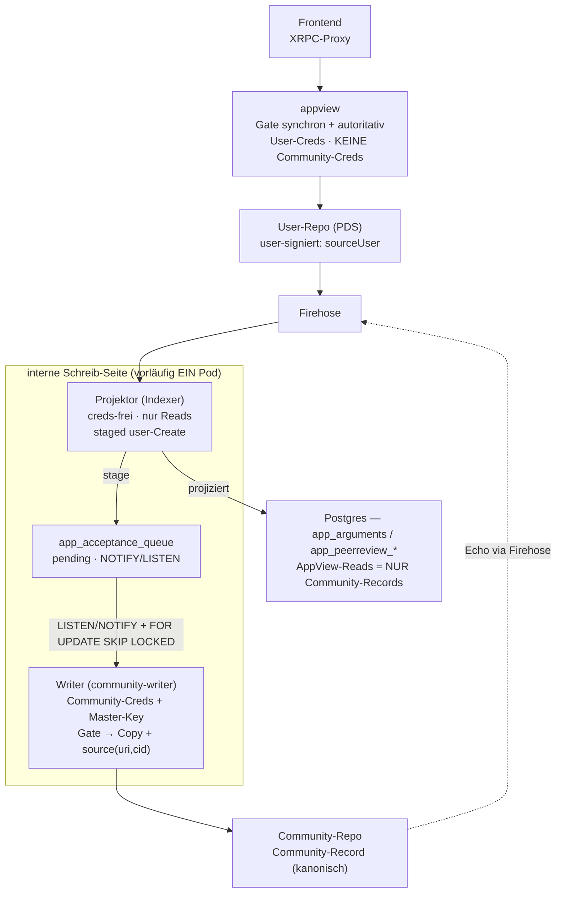

# ATProto-native Deliberation

> **Status:** Phasen 1–4 implementiert, **flag-gated & dormant** (Default-Verhalten unverändert).
> Volle Design-Historie + offene Phasen 5–7: Plan `typed-kindling-flask` · Umsetzung: `CHANGELOG.md`
> (Einträge „ATProto-native Deliberation — Phase 1–4") · Härtungs-TODOs: `doc/TODO.md`.

## Worum es geht

Heute schreibt die **appview** (internet-zugewandt) sämtliche Deliberations-Records (Argumente,
Peerreview-Responses, Invitations, Crossposts, Übersetzungen) ins **Per-Ballot-Community-Repo** und hält
dafür die Community-Credentials (`auth.community_accounts`, entschlüsselt mit dem Master-Key). Damit ist
der am stärksten exponierte Dienst Träger der mächtigsten Schreib-/Credential-Fähigkeit.

**Ziel:** Die appview verliert den Zugriff aufs Community-Repo. **User-authored** Inhalte werden
self-signed ins **eigene User-Repo** geschrieben (trustless: ATProto erlaubt keine Writes in fremde Repos →
kryptographisch belegt, wer was initiiert hat). Eine **interne Schreib-Seite** akzeptiert sie nach Prüfung
und schreibt den kanonischen **Community-Record** ins Community-Repo.

## Architektur

*(Eine gerenderte Bildfassung kann optional unter `doc/img/atproto-native-deliberation.png` abgelegt werden;
das Mermaid oben ist die kanonische, versionierte Quelle.)*

## Zwei Leitentscheidungen (keine Ausnahmen)

1. **Kein appview→Indexer-Kanal.** Die appview sendet der internen Seite **nichts** — weder Service-Repo-Record
   noch Outbox. Community-seitige Aktionen werden aus **Firehose + Postgres** abgeleitet.
2. **Community-Record = Copy mit Herkunfts-Referenz.** Der Community-Record trägt den **vollen Inhalt**
   (Kopie) **plus** `source:{originUri, originCid}` auf den user-signierten Original-Record. Kein reference-only.
   So sind beide signierten Aussagen sauber getrennt: *Autorschaft* (User-Repo, user-signiert) und
   *Community-Akzeptanz* (Community-Repo, gov-signiert, per CID an das Original gepinnt).

## Rollen-Arbeitsteilung

| | **Projektor** (Indexer, Node) | **Writer** (community-writer, Python) |
|---|---|---|
| Hält | kein Community-Key, keine `pw`-Spalten, keine PDS-Writes | **Community-Key + Community-Creds** + PDS-Sessions |
| Firehose | abonniert + projiziert (einziger Consumer) | **kein** Firehose-Client — pollt die DB-Work-Queue |
| PDS | nur lesen (Firehose) | **schreibt** ins Community-Repo |
| Aufgaben | alle Projektionen, `bsky_poller` | Gate, Community-Record, Crossposts, Translator, Assignment |

> **Vorläufig ein Pod** (logische Trennung). Der Writer ist heute ein eigener Prozess mit demselben
> appview-Image, anderem Command (`python -m src.writer_main`) — er **wiederverwendet** appviews Python-Code
> (`atproto/community.py`, `atproto/crosspost.py`, `atproto/acceptance.py`). Die **Naht**
> `app_acceptance_queue` bleibt erhalten, damit ein späterer physischer Pod-Split nur ein Deployment-Schritt
> ist (Trigger: Föderation oder Skalierung). Siehe Plan, **L9**.

## Der Loop (am Beispiel Argument)

1. User → schreibt `#sourceUser`-Argument ins **eigene Repo** (via appview-Proxy, User-Creds). appview gated
   synchron (Eligibility + Quota-Reservierung) und lehnt bei Bedarf **inline** ab — Sofort-Feedback wie heute.
2. Firehose trägt den User-Record.
3. **Projektor** sieht `collection=ballot.argument ∧ action=create ∧ !isCommunityDid(did)` → stellt eine
   Zeile in `app_acceptance_queue` (`+ NOTIFY`). User-Repo-Originale gehen **nicht** ins Lese-Modell.
4. **Writer** wird via `LISTEN/NOTIFY` geweckt, claimed die Zeile (`FOR UPDATE SKIP LOCKED`), gated
   (Eligibility-View) und schreibt den **Community-Record** (Inhalts-Kopie + `source:{originUri,originCid}`)
   unter der Community-DID — mit **deterministischem create-only rkey** (idempotent, crash-recovery).
5. Der community-signierte Community-Record kommt über den **Firehose zurück** zum Projektor.
6. **Projektor projiziert** ihn nach `app_arguments` (`origin_uri/origin_cid` mit dabei) — **exakt der
   heutige Pfad**. Crosspost + Übersetzung folgen writer-seitig.

**Drei Pfade, eine Pipeline** — nur Input/Output unterscheiden sich (`kind` in der Queue):

| Pfad | Input (User-Repo) | Writer | Output (Community-Repo) |
|------|-------------------|--------|--------------------------|
| Argument (1:1) | `ballot.argument` #sourceUser | Gate → Copy+Ref | 1 Community-Argument |
| PR-Response (1:1) | `peerreview.response` | Gate → Copy+Ref, rkey=`compose_review_rkey` | 1 Community-Response |
| Invitations (1:N) *(Phase 6)* | `request_for_peerreview` | Assignment-Lotterie | N `peerreview.invitation` |

## Die Naht: `app_acceptance_queue`

Die **einzige neue Tabelle** — Projektor→Writer-Handoff **und** Reconcile-Queue in einem:
`(user_uri UNIQUE, user_cid, did, kind∈{argument,response,request}, ballot, status∈{pending,done,rejected},
reason, record jsonb, …)`. Crash-sicher (`SKIP LOCKED`), idempotent (`UNIQUE(user_uri)` + deterministischer
rkey), Echtzeit via `LISTEN/NOTIFY` + periodischer Poll als Netz. **Writer→Projektor braucht keinen Kanal** —
der Community-Record kommt über den Firehose zurück. (Diese *interne* Queue widerspricht „kein Kanal" nicht — das
galt für *appview*.)

## Datenmodell

- **`app_acceptance_queue`** — siehe oben.
- **`app_arguments` / `app_peerreview_responses`** — neue Spalten `origin_uri` / `origin_cid` (Provenienz aufs
  User-Original; null für Legacy/official/org). Projektion sonst wie heute.
- **`auth.v_eligible_participants(did, eligible)`** — schmale View über `auth_creds` (registriert = eligible;
  Ban-/eID-Overlay dockt später an). Die interne Seite prüft Eligibility **ohne** Email/Cred-Zugriff (View
  läuft mit Owner-Rechten). Wahrt das auth-Hardening.

## Sicherheitsmodell

- Community-Creds + Master-Key liegen auf der **internen** Schreib-Seite, nicht mehr in der internet-zugewandten
  appview. appview behält den Master-Key nur noch für **User**-App-Passwörter (`auth_creds`) → Empfehlung:
  Master-Key in zwei separate Keys splitten (User-Key in appview, Community-Key in Writer/CMS); siehe `doc/TODO.md`.
- **Gate:** appview prüft synchron & autoritativ für den Frontend-Pfad (Inline-Reject); die interne Seite
  re-prüft als Backstop für Nicht-appview-/Föderations-Writes und **überstimmt** appview nicht (gemeinsamer
  Quota-Ledger `app_content_creations`). Kein lautloses Verschwinden (Per-Submission-Status).
- **Drift gelöst:** die interne Seite reagiert nur auf **Create**-Events; der Community-Record gehört dem
  Community-Konto → vom Autor nicht editier-/zurückziehbar (Retraktion nur über Moderation/Ozone).

## Feature-Flags (Rollout)

Der gesamte neue Pfad ist hinter Flags, **Default aus** → heutiges Verhalten unverändert. Zum Aktivieren
**gemeinsam** schalten (sonst Producer ohne Consumer):

| Flag | Dienst | Wirkung |
|------|--------|---------|
| `APPVIEW_ARGS_USER_REPO_ENABLED` | appview | Argument-Create → User-Repo statt Community |
| `APPVIEW_RESPONSES_USER_REPO_ENABLED` | appview | PR-Response → Reviewer-Repo statt Community |
| `ACCEPTANCE_PIPELINE_ENABLED` | Indexer **und** Writer | Projektor staged; Writer drained die Queue |

## Föderation (Ausblick, viel später)

Die firehose-native, gegatete Architektur macht das Öffnen für fremde PDS zu einer **Konfig-Frage**:
`FIREHOSE_URL` auf einen **Relay** zeigen (statt einzelner PDS); der NSID-Filter greift nur die POLTR-Records;
das autoritative Gate entscheidet, wessen Records akzeptiert werden → automatisch spam-resistent.
Cross-PDS-Authorship via DID-Auflösung verifizierbar.

## Bekannte Grenzen / vor Prod härten

Siehe `doc/TODO.md` → „Härtung der Akzeptanz-Pipeline": Long-Transaction über den PDS-Write,
Head-of-line-Blocking ohne Dead-Letter/Backoff, Writer-Quota (vertraut noch der appview-Reservierung).
